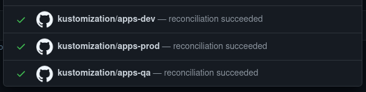

# GitOps Promotion

## Overview

gitops-promotion is tool to do automatic promotion with a GitOps workflow. It is ideally suited for use with [Kubernetes](https://kubernetes.io) manifests and a controller such as [Flux](https://fluxcd.io).

gitops-promotion interacts with a Git provider to do automatic propagation of container images across a succession of environments. Supported Git providers:

- GitHub
- Azure Devops

## The workflow

gitops-promotion workflow assumes a separation of one or more "app" repositories, which results in container images, and the repository (or repositories) that hold manifests that describe how those containers are deployed. We refer to this repository as the "GitOps" repository. Assuming a typical dev/qa/production succession of environments, gitops-promotion is meant to support a workflow that looks like this:

1. A pipeline in `webui` app repository builds, tests and delivers an image to the container registry.
1. The new container image triggers a new promotion (`gitops-promotion new`) in the GitOps repository. It creates a new branch `promote/webshop-webui` an auto-merging pull request for the "dev" env. It updates the manifest of the app with the new image.
1. The auto-merge triggers the promote pipeline (`gitops-promote promote`) in the GitOps repository. This pipeline goes through the same steps as "new" above except that it targets the next environment, in this case the "qa" environment.
1. The promotion pull request for the "qa" env triggers the "status" pipeline (`gitops-promotions status`). This pipeline checks the status of the "dev" pull request (including any reconciliation status added by Flux) and reports that status as its own.
1. Assuming the "dev" pull request status is green, the "qa" pull request is merged.
1. Steps 4. and 5. are repeated for the "production" environment, but without auto-merge, so that they can be applied at an opportune time.

Conceptually, this means that:

- all new container images are applied to the "dev" environment
- all new container images that are successfully applied will be propagated to the "qa" environment
- pull requests for applying changes to the production environment are automatically created and can be merged by testers or product owners once they have been validated in the "qa" environment.

See the provider-specific sections below for details about how to implement these pipelines.

## The commands

### gitops-promotion new

```shell
$ gitops-promotion new --help
Usage of new:
  -app string
        Name of the application
  -group string
        Main application group
  -provider string
        git provider to use (default "azdo")
  -tag string
        Application version/tag to set
  -token string
        Access token (PAT) to git provider
```

The `new` command goes through this process:

   1. creates a new branch `promote/<group>-<app>` (or resets it if it already exists),
   1. updates the image tag for the app manifest in the first environment listed in the config file to the newly released container image (see below for more info how this works),
   1. creates an auto-merging pull request,
   1. Assuming the pull request has no failing checks, it is automatically merged into main, where a service such as Flux can apply it to the first environment.

### gitops-promotion promote

```shell
$ gitops-promotion promote --help
Usage of promote:
  -provider string
        git provider to use (default "azdo")
  -token string
        Access token (PAT) to git provider
```

The `promote` command is meant to be used in a pipeline that reacts to merge operations to the main branch that resulted from `new` or `promote` command. It looks up the pull request and uses the information contained therein to create a new pull request, following the process outlined under the `new` command.

### gitops-promotion status

```shell
$ gitops-promotion status --help
Usage of status:
  -provider string
        git provider to use (default "azdo")
  -token string
        Access token (PAT) to git provider
```

The `status` command requests statuses on the merge commit that resulted from the previous' environment's pull request. It looks for a status check with context `*/<group>-<env>`. This matches the metadata name of a [Kustomization](https://fluxcd.io/docs/components/kustomize/kustomization/) resource as retported by the Flux Notification controller (in this case group is "apps"):



It keeps looking for that status for some time. If it remains failed after some minutes, the `status` command fails, resulting in a failed check on the pull request, blocking any automatic merging.

## The GitOps repository

gitops-promotion assumes a repository with a layout like this (excluding CI pipeline definitions). In Flux, this is referred to as a [Monorepo](https://fluxcd.io/docs/guids/repository-structure/#monorepo) layout:

```.shell
|-- gitops-promotion.yaml
|-- <group 1>
|   |-- <environment 1>
|   |   |-- ... <-- your Kubernetes YAML here
|   |   <environment 2>
|   <group 2>
|   |-- ...
```

Assuming we are serving a webshop from Kubernetes with three environments, the file structure may looks something like this:

```.shell
|-- gitops-promotion.yaml
|-- webshop
|   |-- dev
|   |   |-- cart.yaml
|   |   |-- webui.yaml
|   |-- qa
|   |   |-- cart.yaml
|   |   |-- webui.yaml
|   |   production
|   |   |-- cart.yaml
|   |   |-- webui.yaml
```

See below for details about the `gitops-promotion.yaml` file.

gitops-promotion uses [Flux image-automation-controller](https://github.com/fluxcd/image-automation-controller) to update the Container image tag for containers in your manifests. You annotate the image reference in your manifest (or in your Kustomization `image` override) like so, where `<group>` and `<app>` are arbitrary names that you use to group and name the services gitops-promotion is working with. For more information, see [Configure image updates](https://fluxcd.io/docs/guides/image-update/#configure-image-updates) in the Flux documentation.

```yaml
image: some/image:latest # {"$imagepolicy": "<group>:<app>:tag"}
```

For example, you may have a very simple manifest like this:

```yaml
apiVersion: apps/v1
kind: Pod
metadata:
  name: webui
spec:
  containers:
    - name: webui
      image: ghcr.io/my-org/webui:1234567 # {"$imagepolicy": "webshop:ui:tag"}
```

When you have pushed a new image to your container registry, the pipeline runs the following command to start the promotion of your latest image across the configured environments:

```shell
gitops-promotion new --provider azdo --token s3cr3t --group webshop --app webui --tag 26f50d84db02
```

This will instruct gitops-promotion to look up the `$imagepolicy` entry `webshop:webui:tag` and update the container tag to refer to the tag `26f50d84db02` with the expectation that a GitOps controller such as Flux will react to this change and update the corresponding environment accordingly.

## Configuration

The `gitops-promotion.yaml` lists environment names and whether they allow automatic promotion. A typical config file looks like this. gitops-promotion will promote your change across environments in this order.

```.yaml
environments:
  - name: dev
    auto: true
  - name: qa
    auto: true
  - name: prod
    auto: false
```

| property            | usage                                                                               |
| ------------------- | ----------------------------------------------------------------------------------- |
| environments[].auto | Whether pull requests for this environment auto-merge or not                        |
| environments[].name | The name for this environment. Must correspond to a directory present in all groups |

## Using with Azure Devops

Support for Azure DevOps is mature, but alas the documentation is not. TBD.

## Using with Github

gitops-promotion has full support for GitHub.

### Required repository configuration

gitops-promotion makes use of [PR auto-merge](https://docs.github.com/en/pull-requests/collaborating-with-pull-requests/incorporating-changes-from-a-pull-request/automatically-merging-a-pull-request). This requires specific configuration:

1. In repository settings, turn on "Allow auto-merge"
1. Set up a branch protection rule for your "main" branch:
  - "Require a pull request before merging"
  - "Require status checks to pass"
  - Add the workflow for the `status` commend to "Status checks that are required". In the example below, you would enter "prev-env-status". Bizarrely, the UI will not allow you to enter the name, so you may have to trigger a run once so you can use the search interface.

You can verify that your settings are correct by manually creating a pull request and verify that the button says "Enable auto-merge".

### Configuring your workflow

gitops-promotion is available as a Github Action.

Depending on which container registry you are using, you may be able to set up triggers that activates your gitops-promotion workflow. If this is not the case, you can use GitHub [repository_dispatch](https://docs.github.com/en/actions/learn-github-actions/events-that-trigger-workflows#repository_dispatch) events. These allow GitHub actions on one repository to notify another repository. Use the excellent [repository-dispatch GitHub Action](https://github.com/marketplace/actions/repository-dispatch) for readable YAML. You would add a step at the end of your container-building workflow that looks something like this:

```yaml
      - name: Notify gitops-promotion workflow
        uses: peter-evans/repository-dispatch@v1
        with:
          token: ${{ secrets.GITOPS_REPO_TOKEN }}
          repository: my-org/my-gitops
          event-type: image-push
          client-payload: |
            {
              "group": "apps",
              "app": "my-app",
              "tag": "${{ github.sha }}"
            }
```

The `repository` parameter holds the repository where you want to run `gitops-promotion`. The normal `${{ secrets.GITHUB_TOKEN }}` only has access to the local repository running in which the workflow is running, so we need to set up and pass an access token (GITOPS_REPO_TOKEN) that has access to that repository.

Here is a complete example GitHub workflow for pushing a containerized app to GitHub Container Registry:

```yaml
on:
  push:
    branches:
      - main

jobs:
  build-app:
    runs-on: ubuntu-latest
    steps:
      - name: Checkout
        uses: actions/checkout@v2
      - name: Set up Docker Buildx
        uses: docker/setup-buildx-action@v1
      - name: Login to GitHub Container Registry
        uses: docker/login-action@v1
        with:
          registry: ghcr.io
          username: ${{ github.repository_owner }}
          password: ${{ secrets.GITHUB_TOKEN }}
      - name: Build and push
        uses: docker/build-push-action@v2
        with:
          push: true
          tags: ghcr.io/${{ github.repository_owner }}/my-app:${{ github.sha }}
      - name: Notify gitops-promotion workflow
        uses: peter-evans/repository-dispatch@v1
        with:
          token: ${{ secrets.GITOPS_REPO_TOKEN }}
          repository: ${{ github.repository_owner }}/my-gitops
          event-type: image-push
          client-payload: |
            {
              "group": "apps",
              "app": "my-app",
              "tag": "${{ github.sha }}"
            }
```

In your gitops repository, you can react to `repository-dispatch` events and trigger promotion:

```yaml
on:
  repository_dispatch:
    types:
      - image-push
jobs:
  new-pr:
    runs-on: ubuntu-latest
    steps:
      - name: Checkout
        uses: actions/checkout@v2
        with:
          # gitops-promotion currently needs access to history
          fetch-depth: 0
      - uses: xenitab/gitops-promotion@v0.1.0
        with:
          action: new
          token: ${{ secrets.GITHUB_TOKEN }}
          group: ${{ github.event.client_payload.group }}
          app: ${{ github.event.client_payload.app }}
          tag: ${{ github.event.client_payload.tag }}
```

This simple example will start the promotion of `my-app` onto the first environment defined in the `gitops-promotion.yaml` file. In order to promote `my-app` to further environments, set up a separate workflow that reacts to merges from previous promotions, like so:

```yaml
on:
  push:
    branches:
      - main
jobs:
  promote-app:
    runs-on: ubuntu-latest
    steps:
      - name: Checkout
        uses: actions/checkout@v2
        with:
          # gitops-promotion currently needs access to history
          fetch-depth: 0
      - uses: xenitab/gitops-promotion@v0.1.0
        with:
          action: promote
          token: ${{ secrets.GITHUB_TOKEN }}
```

In order to block automatic promotion, you can add a status workflow:

```yaml
on:
  pull_request:
    branches:
      - main
jobs:
  prev-env-status:
    runs-on: ubuntu-latest
    steps:
      - name: Checkout
        uses: actions/checkout@v2
        with:
          # gitops-promotion currently needs access to history
          fetch-depth: 0
      - uses: xenitab/gitops-promotion@v0.1.0
        with:
          action: status
          token: ${{ secrets.GITHUB_TOKEN }}
```

Please note that you will need to make this a required check for merging into main, so it is important that it runs on all pull requests against "main" or your manual pull requests will not be mergeable.

## Troubleshooting

**GitHub PR creation says "could not set auto-merge on PR"**: Your repository is not properly configured to allow pull request auto-merge. Pleae see the configuration section above for information on how to do this.

## Building

You will need pkg-config and libgit2, please install it from your package manager.

## Testing the GitHub provider

The test suite for the GitHub provider requires access to an actual GitHub repository. In order to run these tests, create an empty repository and set up an access key and invoke the tests like so:

env GITHUB_URL='' GITHUB_TOKEN='' go test ./...

The GitHub Action CI runs the tests against [https://github.com/gitops-promotion/gitops-promotion-testing](https://github.com/gitops-promotion/gitops-promotion-testing).
